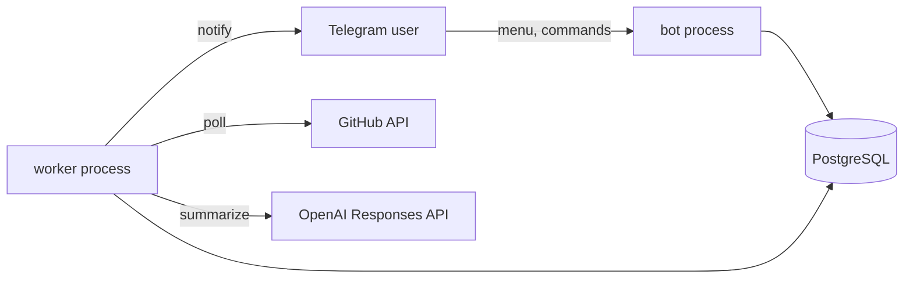

# GitNotifyBot

Telegram bot that watches public GitHub repositories and posts concise,
LLM-generated change summaries the moment a release lands or a tracked
file is updated.

[](https://www.python.org/)
[](https://aiogram.dev/)
[](https://www.postgresql.org/)
[](https://platform.openai.com/)
[](https://docs.astral.sh/ruff/)

## What you get

Add a repo from Telegram. The worker checks GitHub on a schedule. When
something changes, you get a short, focused message in your chat,
written in your preferred language and style:

> ✨ Обновился репозиторий cli/cli (v2.45.0)
>
> Релиз cli/cli v2.45.0
>
> Что нового:
> • Добавлена команда `gh repo lock` для блокировки новых issues.
> • Исправлен сбой при отправке PR review через JSON pipe.
>
> 🔗 https://github.com/cli/cli/releases/tag/v2.45.0

## Features

- **Releases mode.** Watches `GET /releases/latest`, baselines on the
  current release id, alerts only on new ones.
- **File mode.** Watches a single file on the default branch, compares
  blob sha each cycle, summarizes the patch of the most recent commit.
  Works great for `CHANGELOG.md` and similar append-only files.
- **Per-chat preferences.** Each chat picks its summary language (ru/en),
  style (short/detailed) and free-form preferences (e.g. "highlight CLI
  and API changes only").
- **LLM cache.** Same change with the same preferences means one OpenAI
  call, shared across chats; failures are persisted and observable.
- **Always-on menu.** Persistent reply keyboard for the five most-used
  actions plus inline keyboards for sub-flows.
- **Manual recheck.** A "Check now" button reschedules all chat
  subscriptions for the next worker cycle without waiting the interval.

## How it works



Two processes share PostgreSQL. The bot handles Telegram traffic and
writes subscriptions and settings. The worker loops over due
subscriptions, calls GitHub, summarizes changes via the OpenAI Responses
API, and sends the notification through the same bot token.

For a release the worker compares the latest release id with the saved
baseline, and only summarizes the body when the id changes. For a file
it fetches the blob sha and, when it differs, asks GitHub for the patch
of the most recent commit affecting that path so the LLM summarizes the
*latest change* rather than the whole file.

LLM responses are cached in the `llm_summaries` table keyed by
`(update_id, language, style, preferences_hash, prompt_version)`, so two
chats with the same settings share one OpenAI call.

## Tech stack

- **Python 3.13**, asyncio top to bottom
- **aiogram 3** for Telegram (FSM, inline keyboards, reply keyboard)
- **SQLAlchemy 2** async + **asyncpg** + **Alembic** migrations
- **OpenAI Python SDK 2.x**, Responses API with `reasoning` and strict
  `json_schema` output
- **Pydantic 2** for settings, schemas, and prompt loading
- **httpx** for GitHub calls
- **pytest**, **ruff**, **uv**

## Quick start

```bash
cp .env.example .env          # fill in tokens
docker compose up -d postgres
uv sync
uv run alembic upgrade head

uv run python -m app.bot      # one terminal
uv run python -m app.worker   # another terminal
```

Open the bot in Telegram, send `/start`, follow the menu.

## Configuration

| Variable                | Required | Description                                    |
| ----------------------- | -------- | ---------------------------------------------- |
| `TELEGRAM_BOT_TOKEN`    | yes      | Telegram bot token from @BotFather             |
| `DATABASE_URL`          | yes      | PostgreSQL DSN (`postgresql+asyncpg://...`)    |
| `GITHUB_TOKEN`          | yes      | GitHub PAT for higher rate limits              |
| `OPENAI_API_KEY`        | yes      | OpenAI key with access to the configured model |
| `OPENAI_MODEL`          | no       | Default `gpt-5.4-mini`                         |
| `OPENAI_TIMEOUT_SECONDS`| no       | Default `30`                                   |
| `OPENAI_PROMPT_VERSION` | no       | Default `v1`                                   |
| `LOG_LEVEL`             | no       | Default `INFO`                                 |

## Project layout

```
app/
  bot/            aiogram dispatcher, handlers, keyboards
  worker/         polling entrypoint
  application/   release and file polling pipelines, services
  domain/         enums, GitHub repo refs, source-key building
  integrations/
    github/       GitHub REST adapter
    llm/          OpenAI client, prompt loader, summarizers
  prompts/        YAML prompt templates
  storage/        SQLAlchemy models, Alembic migrations
tests/            pytest suite with adapter fakes
```

## Tests and lint

```bash
uv run pytest
uv run ruff check .
```

## Roadmap

- Multiple files per repo aggregated into one summary.
- Branch selector for file mode (currently always default branch).
- GitHub webhooks for instant notifications instead of polling.
- Subscriptions on private repos with per-user GitHub OAuth.
